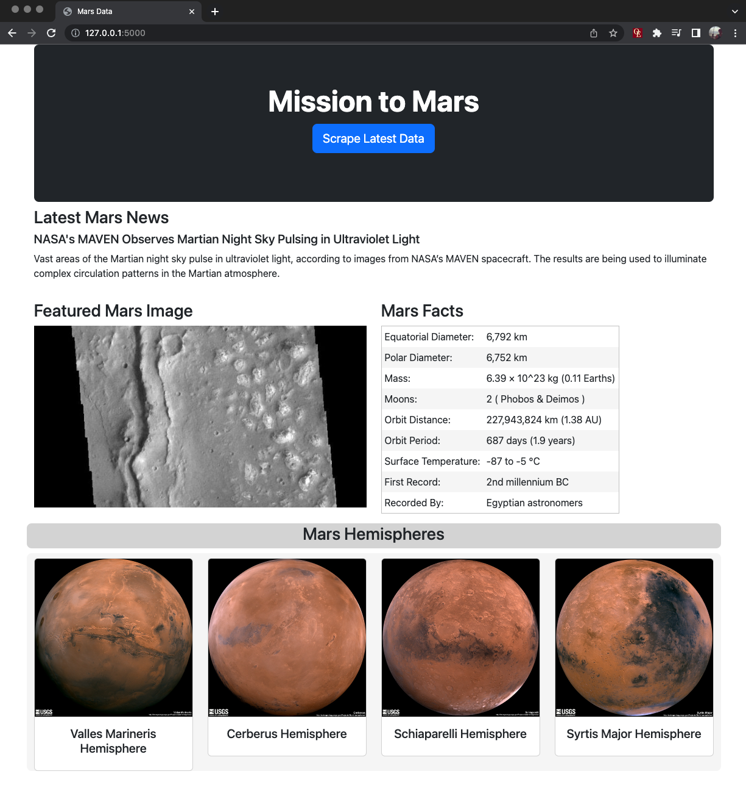

# Mission to Mars
Homework 12 for UMN Data Boot Camp

This assignment was to scrape 4 different websites for data relating to Mars and display the results in a webpage using Bootstrap. 

Follow these steps to run the site locally:
1. Clone and navitgate to the repo in a terminal
1. Activate Python virtual environment
1. Launch the Flask app with the command `python app.py`
1. Go to `127.0.0.1/5000` in your browser
1. Click the "Scrape Latest Data" button to pull the most recent data

This code was written using Python 3.8 and requires the following packages:
* flask
* pymongo
* pandas
* splinter
* Beautiful Soup